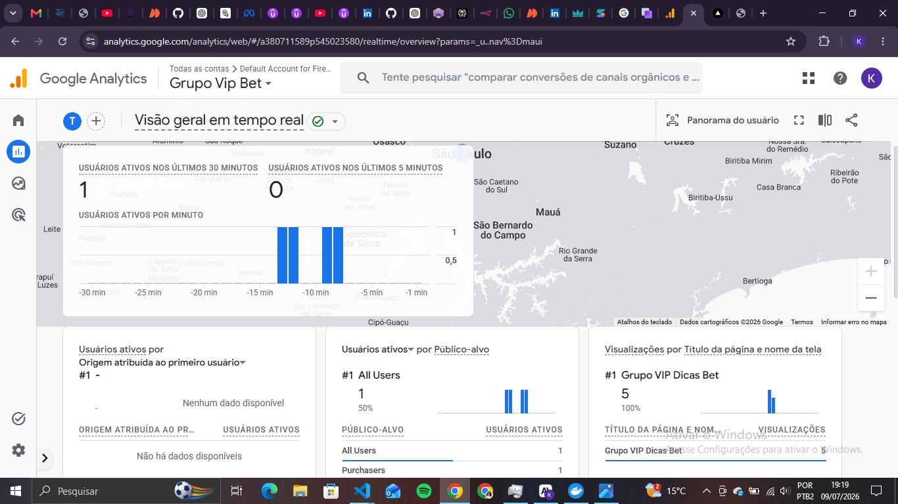
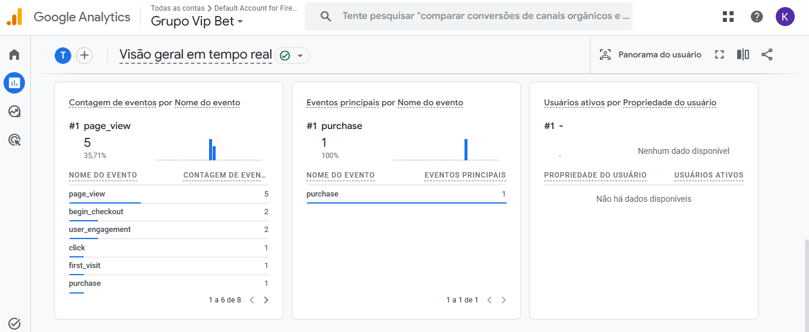
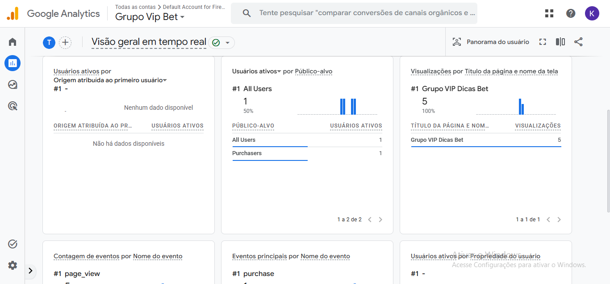
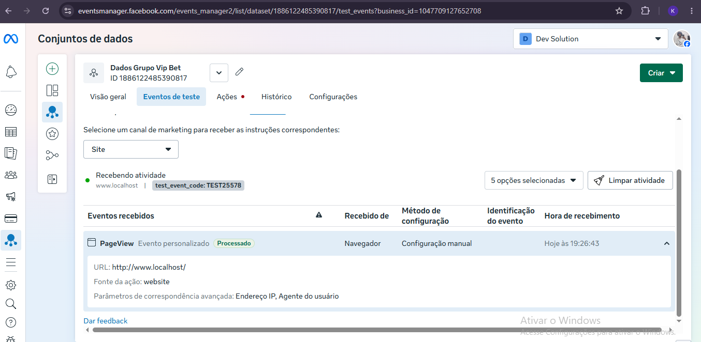
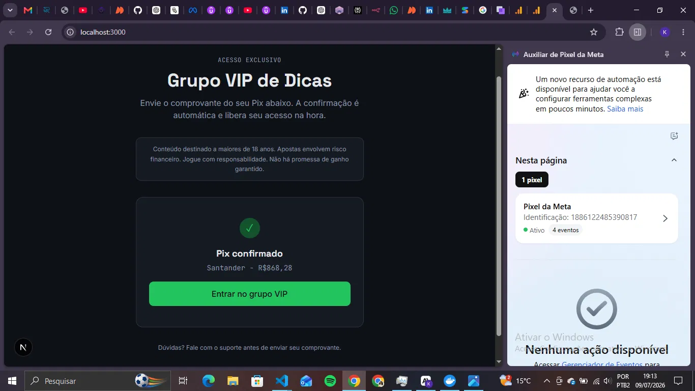
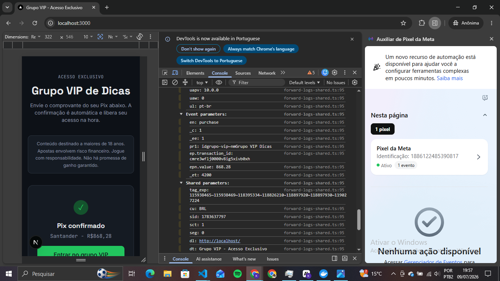

# 🚀 LP Grupo VIP - Validação de Pix com IA (Opção A)

Esta é uma Landing Page funcional desenvolvida para o desafio técnico de lançamento de um Grupo VIP de Dicas em Bet. A solução foca na automação do fluxo de entrada de usuários, utilizando Inteligência Artificial (Gemini Pro Vision) para validação de comprovantes de Pix em tempo real.

---

## 🔗 Links Úteis

- **Link Público:** [grupo-vip-pix.vercel.app](https://grupo-vip-pix.vercel.app)

- **Repositório:** [github.com/kauediniz-dev/LP-Grupo-Vip](https://github.com/kauediniz-dev/LP-Grupo-Vip)

---

## 🛡️ Defesa Técnica da Escolha (Opção A vs Opção B)

### Por que a Opção A?

A escolha pela **Opção A (Pix + IA/OCR)** foi baseada na busca por um desafio técnico voltado à **integridade de dados e automação de backend**. Enquanto a Opção B foca mais em UX de funil e automação de e-mail, a Opção A exige uma integração robusta com modelos de visão computacional, tratamento de arquivos sensíveis e uma lógica de validação que impacta diretamente a conversão financeira do produto.

### Trade-offs e Riscos

- **Risco de Falso Negativo:** Modelos de OCR podem falhar em prints de baixa qualidade. Para mitigar isso, implementamos uma lógica de "confiança" (confidence score) e mensagens de erro amigáveis que instruem o usuário a reenviar o print.

- **Privacidade:** Comprovantes contêm dados sensíveis. A arquitetura foi desenhada para não persistir a imagem original após o processamento, mantendo apenas os metadados necessários para a validação (banco, valor e status).

---

## 🏗️ Arquitetura e Stack Tecnológica

| Tecnologia                     | Motivação da Escolha                                                                                                                                                                                              |
| ------------------------------ | ----------------------------------------------------------------------------------------------------------------------------------------------------------------------------------------------------------------- |
| **Next.js 15 (App Router)**    | Escolhido pela excelência em SSR/SSG, otimização nativa de imagens e facilidade na criação de API Routes para o processamento da IA.                                                                              |
| **TypeScript**                 | Indispensável para garantir a segurança de tipos em um fluxo que lida com valores monetários e estados complexos de IA.                                                                                           |
| **Prisma + Neon (PostgreSQL)** | O Prisma oferece uma DX (Developer Experience) superior, e o Neon permite um banco de dados Serverless escalável e gratuito para a fase de MVP.                                                                   |
| **Google Gemini Pro Vision**   | Utilizado para o processamento de OCR e IA Multimodal. Diferente de OCRs tradicionais (Tesseract), o Gemini entende o contexto do comprovante, identificando logotipos de bancos e validando a veracidade visual. |
| **Shadcn UI + Tailwind CSS**   | Garantia de uma interface moderna, responsiva e acessível com tempo de desenvolvimento reduzido.                                                                                                                  |

---

## 📊 Tracking e Eventos (Meta Pixel & GA4)

O projeto implementa um funil de tracking completo para medir a intenção e a conversão:

1. **PageView:** Disparado no carregamento da página.

1. **InitiateCheckout:** Disparado no momento em que o usuário seleciona um arquivo para upload.

1. **Purchase:** Disparado apenas após a validação positiva da IA (retorno de sucesso do Gemini).

### ⚠️ Limitação Identificada: Supressão do Meta Pixel

Durante o desenvolvimento, identificamos que o Meta Pixel suprime automaticamente os eventos `InitiateCheckout` e `Purchase` nesta implementação.

- **Sintoma:** Mensagem _"You are attempting to send a restricted event. The event was suppressed"_ no console.

- **Causa:** Política de compliance do Meta para o setor de **Apostas e Jogos de Azar** em contas/pixels não verificados.

- **Prova Técnica:** O **GA4 (Google Analytics)** recebeu e processou os mesmos eventos com sucesso, confirmando que a implementação do código está correta e o problema é de política de plataforma.

---

## 📸 Evidências de Funcionamento (Tracking & IA)

Abaixo estão os registros das validações realizadas durante os testes:

### Google Analytics 4 (GA4)

| Descrição                          | Imagem                                                       |
| ---------------------------------- | ------------------------------------------------------------ |
| Visualização geral de dados no GA4 |          |
| Detalhamento de eventos capturados |  |
| Fluxo de conversão do Grupo VIP    |     |

### Meta Pixel

| Descrição                                     | Imagem                                                                   |
| --------------------------------------------- | ------------------------------------------------------------------------ |
| Disparo do evento PageView                    |  |
| Diagnóstico de eventos (4 eventos rastreados) |     |
| Registro de bloqueio por categoria de aposta  |       |

---

## 🛠️ Como Executar o Projeto

1. **Clonar o repositório:**

   ```bash
   git clone https://github.com/kauediniz-dev/LP-Grupo-Vip.git
   ```

1. **Instalar dependências:**

   ```bash
   npm install
   ```

1. **Configurar Variáveis de Ambiente (.env ):**Crie um arquivo `.env` na raiz com as seguintes chaves:

   ```
   DATABASE_URL="sua_url_do_neon"
   GOOGLE_GENERATIVE_AI_API_KEY="sua_chave_do_google_ai_studio"
   NEXT_PUBLIC_META_PIXEL_ID="id_do_seu_pixel"
   NEXT_PUBLIC_GA_TRACKING_ID="id_do_seu_ga4"
   ```

1. **Rodar o Prisma:**

   ```bash
   npx prisma generate
   npx prisma db push
   ```

1. **Iniciar em desenvolvimento:**

   ```bash
   npm run dev
   ```

---

## 🔞 Jogo Responsável

Este projeto inclui avisos de conformidade:

- Proibido para menores de 18 anos.

- Links para políticas de Jogo Responsável.

- Isenção de responsabilidade sobre ganhos garantidos.

---

**Desenvolvido por **[**Kauê Dinis**](https://github.com/kauediniz-dev) 🚀
